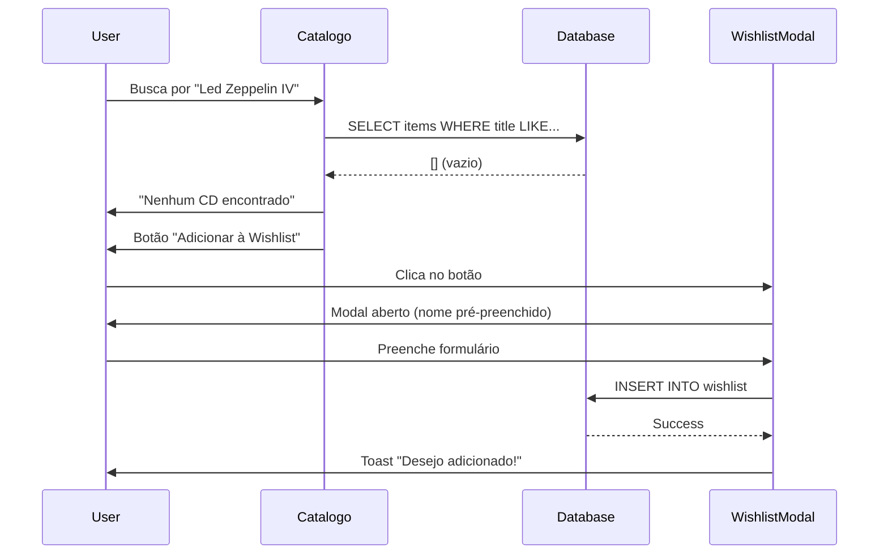
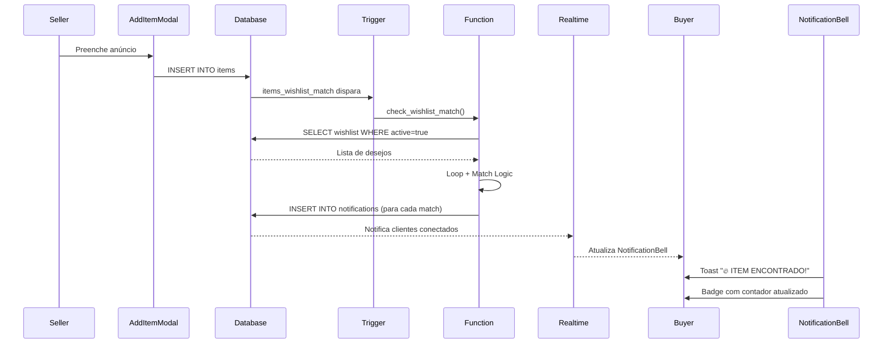
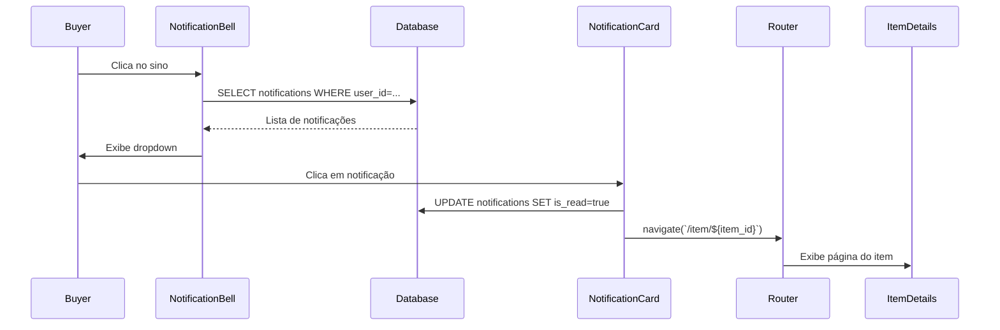

# 🎯 SISTEMA DE WISHLIST E NOTIFICAÇÕES - GUIA COMPLETO

## 📖 ÍNDICE

1. [Visão Geral](#visão-geral)
2. [Arquitetura do Sistema](#arquitetura-do-sistema)
3. [Banco de Dados](#banco-de-dados)
4. [Algoritmo de Match](#algoritmo-de-match)
5. [Componentes Frontend](#componentes-frontend)
6. [Sistema de Notificações](#sistema-de-notificações)
7. [Fluxo de Uso](#fluxo-de-uso)
8. [Consultas SQL Úteis](#consultas-sql-úteis)
9. [Troubleshooting](#troubleshooting)

---

## 🎯 VISÃO GERAL

O **Sistema de Wishlist** permite que colecionadores cadastrem itens raros que procuram. Quando esses itens são anunciados no marketplace, o sistema **automaticamente** notifica todos os interessados em tempo real.

### Principais Características:
- 🔍 **Match Inteligente**: Busca parcial por nome, artista e categoria
- 💰 **Filtro de Preço**: Só notifica se estiver dentro do orçamento
- ⚡ **Tempo Real**: Trigger PostgreSQL dispara no INSERT de items
- 🔔 **Notificações Push**: Interface com dropdown e badges
- 🎨 **Visual Diferenciado**: Cards com borda pontilhada dourada
- 📊 **Analytics**: Queries para monitorar popularidade e conversão

---

## 🏗️ ARQUITETURA DO SISTEMA

```
┌─────────────────────────────────────────────────────────┐
│                    FRONTEND (React)                      │
├─────────────────────────────────────────────────────────┤
│  - WishlistComponents.jsx (Modal, Card, EmptyState)     │
│  - NotificationBell.jsx (Dropdown com realtime)          │
│  - Profile.jsx (Aba "Meus Desejos")                     │
│  - Catalogo.jsx (Botão "Adicionar à Wishlist")          │
└─────────────────────────────────────────────────────────┘
                            ↓ ↑
┌─────────────────────────────────────────────────────────┐
│                SUPABASE (Backend)                        │
├─────────────────────────────────────────────────────────┤
│  TABELAS:                                                │
│  - wishlist (id, user_id, item_name, max_price...)      │
│  - notifications (id, user_id, type, title, message...) │
│                                                          │
│  TRIGGER:                                                │
│  - items_wishlist_match (dispara após INSERT em items)  │
│                                                          │
│  FUNÇÃO:                                                 │
│  - check_wishlist_match() → Algoritmo de match          │
│                                                          │
│  RPC:                                                    │
│  - get_unread_notifications_count()                     │
│  - mark_all_notifications_read()                        │
│  - cleanup_old_notifications()                          │
│                                                          │
│  REALTIME:                                               │
│  - Channel 'notifications' para updates instantâneos    │
└─────────────────────────────────────────────────────────┘
```

---

## 🗄️ BANCO DE DADOS

### Tabela: `wishlist`

```sql
CREATE TABLE wishlist (
  id uuid PRIMARY KEY DEFAULT gen_random_uuid(),
  user_id uuid REFERENCES auth.users(id) NOT NULL,
  item_name text NOT NULL,           -- "Dark Side of the Moon"
  artist text,                        -- "Pink Floyd"
  max_price decimal(10, 2),          -- 200.00
  category text,                      -- "Novo", "Seminovo", etc
  description text,                   -- Observações adicionais
  active boolean DEFAULT true,        -- Se false, não faz match
  created_at timestamptz DEFAULT now(),
  updated_at timestamptz DEFAULT now()
);
```

**Índices:**
- `idx_wishlist_user` (user_id)
- `idx_wishlist_active` (active)
- `idx_wishlist_item_name` (LOWER(item_name)) - Para busca case-insensitive
- `idx_wishlist_category` (LOWER(category))

**RLS Policies:**
- ✅ Usuários veem apenas seus desejos
- ✅ Usuários criam seus próprios desejos
- ✅ Usuários atualizam/deletam apenas os seus

---

### Tabela: `notifications`

```sql
CREATE TABLE notifications (
  id uuid PRIMARY KEY DEFAULT gen_random_uuid(),
  user_id uuid REFERENCES auth.users(id) NOT NULL,
  type text NOT NULL,                -- 'wishlist_match', 'transaction', 'review', 'message', 'system'
  title text NOT NULL,               -- "🔥 ITEM ENCONTRADO!"
  message text NOT NULL,             -- "O item X está disponível..."
  item_id uuid REFERENCES items(id), -- Link para o item
  related_id uuid,                   -- ID de transação, review, etc
  is_read boolean DEFAULT false,
  created_at timestamptz DEFAULT now()
);

-- Constraint no tipo
CHECK (type IN ('wishlist_match', 'transaction', 'review', 'message', 'system'))
```

**Índices:**
- `idx_notifications_user` (user_id)
- `idx_notifications_read` (is_read)
- `idx_notifications_created` (created_at DESC)
- `idx_notifications_type` (type)

**RLS Policies:**
- ✅ Usuários veem apenas suas notificações
- ✅ Sistema pode criar notificações para qualquer um
- ✅ Usuários atualizam/deletam apenas as suas

---

## 🧠 ALGORITMO DE MATCH

### Função: `check_wishlist_match()`

```sql
CREATE FUNCTION check_wishlist_match(
  new_item_title text,
  new_item_artist text,
  new_item_category text,
  new_item_price decimal,
  new_item_id uuid
)
```

### Lógica de Match:

```
PARA CADA desejo ativo NA wishlist:
  
  1. MATCH POR NOME (parcial, case-insensitive)
     - "Dark Side" encontra "Dark Side of the Moon"
     - "Pink Floyd" encontra "The Best of Pink Floyd"
  
  2. MATCH POR ARTISTA (parcial, case-insensitive)
     - "Floyd" encontra "Pink Floyd"
  
  3. MATCH POR CATEGORIA (exato, case-insensitive)
     - "novo" = "Novo"
  
  4. VERIFICAR PREÇO MÁXIMO
     - Se max_price = NULL → aceita qualquer preço
     - Se item_price <= max_price → match confirmado!
  
  5. SE MATCH CONFIRMADO:
     - Inserir notificação na tabela notifications
     - Tipo: 'wishlist_match'
     - Título: "🔥 ITEM ENCONTRADO!"
     - Mensagem: "O item [X] está disponível por R$ [Y]"
     - item_id: UUID do item para navegação direta
```

### Trigger Automático:

```sql
CREATE TRIGGER items_wishlist_match
  AFTER INSERT ON items
  FOR EACH ROW
  EXECUTE FUNCTION trigger_wishlist_match();
```

**Quando dispara:**
- ✅ Sempre que um novo item for inserido na tabela `items`
- ✅ Executa `check_wishlist_match()` automaticamente
- ✅ Não afeta performance do INSERT (executa após commit)

---

## 🎨 COMPONENTES FRONTEND

### 1. WishlistModal

**Arquivo:** `src/components/WishlistComponents.jsx`

```jsx
<WishlistModal
  isOpen={showModal}
  onClose={() => setShowModal(false)}
  editingWish={null}  // ou objeto para edição
  onWishAdded={() => reloadWishlist()}
/>
```

**Props:**
- `isOpen` (boolean): Controla visibilidade
- `onClose` (function): Callback ao fechar
- `editingWish` (object | null): Se não null, modo edição
- `onWishAdded` (function): Callback após salvar

**Campos do Formulário:**
- Nome do Item * (required)
- Artista (opcional)
- Preço Máximo (opcional)
- Categoria (opcional) - Select com opções
- Observações (opcional) - Textarea 500 chars

**Validações:**
- ✅ Nome do item obrigatório
- ✅ Verifica autenticação antes de salvar
- ✅ Trim em todos os campos de texto
- ✅ Parse de decimal para max_price

---

### 2. WishlistCard

```jsx
<WishlistCard
  wish={wishObject}
  onEdit={(w) => setEditingWish(w)}
  onDelete={(id) => removeFromList(id)}
  onToggleActive={(id) => toggleActive(id)}
/>
```

**Elementos Visuais:**
- 🎨 **Border:** `border-dashed border-[#D4AF37]` quando ativo
- 💛 **Ícone:** Coração preenchido dourado
- ⚙️ **Ações:** Ativar/Pausar, Editar, Remover
- 📊 **Status Badge:** "🔍 Buscando" ou "⏸️ Pausado"
- 📅 **Data:** "Adicionado em DD/MM/YYYY"

**Layout:**
```
┌─────────────────────────────────────────┐
│ ❤️ Dark Side of the Moon     [✓][✎][🗑]│
│ ✨ Pink Floyd                           │
│ 💲 Até: R$ 200.00                       │
│ 🏷️ Categoria: Novo                      │
│ ─────────────────────────────────────── │
│ Observações: Primeira prensagem...      │
│ ─────────────────────────────────────── │
│ Adicionado em 24/02/2026  [🔍 Buscando]│
└─────────────────────────────────────────┘
```

---

### 3. WishlistEmptyState

```jsx
<WishlistEmptyState onAddWish={() => openModal()} />
```

**Exibição:**
- 🎨 Ícone de coração grande em círculo dourado
- 📝 Mensagem: "Sua Wishlist está vazia"
- 🔘 Botão CTA: "Adicionar Primeiro Desejo"

---

### 4. NotificationBell (Atualizado)

**Arquivo:** `src/components/NotificationBell.jsx`

```jsx
<NotificationBell />
```

**Funcionalidades:**
- 🔔 Ícone de sino sempre visível (top-right)
- 🔴 Badge com contador de não lidas
- ✨ Animação de pulse quando há notificações
- 📋 Dropdown com lista completa
- ⚡ Realtime via Supabase channel
- 🍞 Toast quando nova notificação chega
- ✅ Marcar como lida (individual ou todas)

**Tipos de Notificação com Ícones:**
- ❤️ `wishlist_match` - Dourado
- 📦 `transaction` - Azul
- ⭐ `review` - Amarelo
- 💬 `message` - Verde
- ✨ `system` - Roxo

**Dropdown Layout:**
```
┌─────────────────────────────────────┐
│ 🔔 Notificações          [✓✓] [X]  │
├─────────────────────────────────────┤
│ [❤️] 🔥 ITEM ENCONTRADO!            │
│      "Dark Side..." R$ 150          │
│      5m atrás               🔴      │
├─────────────────────────────────────┤
│ [📦] Transação Concluída            │
│      Compra aprovada               │
│      2h atrás                      │
├─────────────────────────────────────┤
│ [⭐] Nova Avaliação                 │
│      Você recebeu 5 estrelas       │
│      1d atrás                      │
├─────────────────────────────────────┤
│ 💬 3 mensagens novas        VER →  │
└─────────────────────────────────────┘
```

**Realtime Setup:**
```javascript
const channel = supabase
  .channel('notifications')
  .on('postgres_changes', {
    event: 'INSERT',
    schema: 'public',
    table: 'notifications',
    filter: `user_id=eq.${userId}`
  }, (payload) => {
    // Adicionar nova notificação
    setNotifications(prev => [payload.new, ...prev]);
    
    // Toast para wishlist_match
    if (payload.new.type === 'wishlist_match') {
      toast.success('🔥 ' + payload.new.title);
    }
  })
  .subscribe();
```

---

## 🔔 SISTEMA DE NOTIFICAÇÕES

### Tipos de Notificações Suportados:

| Tipo | Título Exemplo | Quando Dispara | Ícone |
|------|----------------|----------------|-------|
| `wishlist_match` | 🔥 ITEM ENCONTRADO! | Item compatível inserido | ❤️ |
| `transaction` | 💰 Transação Atualizada | Status muda | 📦 |
| `review` | ⭐ Nova Avaliação | Review recebido | ⭐ |
| `message` | 💬 Nova Mensagem | Mensagem recebida | 💬 |
| `system` | ℹ️ Aviso do Sistema | Admin/Sistema | ✨ |

### Criar Notificação Manualmente:

```sql
INSERT INTO notifications (user_id, type, title, message, item_id)
VALUES (
  'user-uuid-aqui',
  'wishlist_match',
  '🔥 ITEM ENCONTRADO!',
  'O item "Dark Side of the Moon" está disponível por R$ 150',
  'item-uuid-aqui'
);
```

### RPC Functions:

```sql
-- 1. Contar não lidas
SELECT get_unread_notifications_count('user-uuid');
-- Retorna: integer

-- 2. Marcar todas como lidas
SELECT mark_all_notifications_read('user-uuid');
-- Retorna: void

-- 3. Limpar antigas (padrão 30 dias)
SELECT cleanup_old_notifications(30);
-- Retorna: void
```

---

## 📊 FLUXO DE USO

### Cenário 1: Usuário Procura Item Inexistente



### Cenário 2: Vendedor Anuncia Item Compatível



### Cenário 3: Comprador Vê Notificação



---

## 🔍 CONSULTAS SQL ÚTEIS

### Monitoramento

```sql
-- 1. Dashboard Geral
SELECT 
  (SELECT COUNT(*) FROM wishlist WHERE active = true) as desejos_ativos,
  (SELECT COUNT(DISTINCT user_id) FROM wishlist) as usuarios_com_desejos,
  (SELECT COUNT(*) FROM notifications WHERE type = 'wishlist_match') as total_matches,
  (SELECT COUNT(*) FROM notifications WHERE type = 'wishlist_match' AND created_at >= NOW() - INTERVAL '24 hours') as matches_hoje;

-- 2. Desejos Mais Populares
SELECT 
  LOWER(item_name) as item,
  COUNT(*) as usuarios_procurando,
  AVG(max_price) as preco_medio_aceito
FROM wishlist
WHERE active = true
GROUP BY LOWER(item_name)
HAVING COUNT(*) > 1
ORDER BY COUNT(*) DESC
LIMIT 10;

-- 3. Taxa de Conversão (Match → Conversa)
SELECT 
  COUNT(DISTINCT n.id) as total_matches,
  COUNT(DISTINCT m.id) as conversas_iniciadas,
  ROUND(
    (COUNT(DISTINCT m.id)::numeric / NULLIF(COUNT(DISTINCT n.id), 0)) * 100,
    2
  ) as taxa_conversao_pct
FROM notifications n
LEFT JOIN messages m ON m.receiver_id = n.user_id 
  AND m.created_at > n.created_at
  AND m.created_at < n.created_at + INTERVAL '7 days'
WHERE n.type = 'wishlist_match'
AND n.created_at >= NOW() - INTERVAL '30 days';
```

### Administração

```sql
-- 4. Ver Desejos Órfãos (sem match há muito tempo)
SELECT 
  w.item_name,
  w.created_at,
  AGE(NOW(), w.created_at) as esperando_há,
  COUNT(*) as total_usuarios
FROM wishlist w
LEFT JOIN notifications n ON n.user_id = w.user_id AND n.type = 'wishlist_match'
WHERE w.active = true AND n.id IS NULL
GROUP BY w.item_name, w.created_at
ORDER BY AGE(NOW(), w.created_at) DESC
LIMIT 20;

-- 5. Itens com Potencial de Match
SELECT 
  i.title,
  i.price,
  COUNT(DISTINCT w.user_id) as interessados
FROM items i
JOIN wishlist w ON w.active = true
  AND LOWER(i.title) LIKE '%' || LOWER(w.item_name) || '%'
WHERE i.status = 'disponivel'
GROUP BY i.id, i.title, i.price
ORDER BY COUNT(DISTINCT w.user_id) DESC;
```

---

## 🐛 TROUBLESHOOTING

### Problema: Notificação Não Aparece

**Diagnóstico:**
```sql
-- 1. Verificar se trigger está ativo
SELECT 
  trigger_name, 
  event_manipulation, 
  action_statement
FROM information_schema.triggers
WHERE trigger_name = 'items_wishlist_match';

-- 2. Verificar se há desejos ativos
SELECT COUNT(*) FROM wishlist WHERE active = true;

-- 3. Testar função manualmente
SELECT check_wishlist_match(
  'Dark Side of the Moon',  -- título do item
  'Pink Floyd',              -- artista
  'Novo',                    -- categoria
  150.00,                    -- preço
  'ALGUM-UUID-VALIDO'       -- UUID do item
);

-- 4. Verificar log de notificações criadas
SELECT * FROM notifications 
WHERE type = 'wishlist_match' 
ORDER BY created_at DESC 
LIMIT 5;
```

**Soluções:**
- ✅ Se trigger não existe: Re-executar SQL-Create-Wishlist-Notifications.sql
- ✅ Se não há desejos: Criar pelo menos um desejo de teste
- ✅ Se função falha: Verificar permissões (SECURITY DEFINER)
- ✅ Se notificações não salvam: Verificar RLS policies

---

### Problema: Realtime Não Funciona

**Diagnóstico:**
```sql
-- Verificar se realtime está habilitado na tabela
SELECT schemaname, tablename 
FROM pg_publication_tables 
WHERE pubname = 'supabase_realtime' 
AND tablename = 'notifications';
```

**Solução:**
```sql
-- Habilitar realtime
ALTER PUBLICATION supabase_realtime ADD TABLE notifications;
```

**No Frontend:**
```javascript
// Verificar logs no console
console.log('Subscribed:', channel.state);
```

---

### Problema: Match Não Acontece

**Diagnóstico:**
```sql
-- Simular match com dados reais
WITH test_item AS (
  SELECT 'Dark Side of the Moon' as title,
         'Pink Floyd' as artist,
         'Novo' as condition,
         150.00 as price
),
test_wish AS (
  SELECT * FROM wishlist WHERE active = true LIMIT 1
)
SELECT 
  CASE 
    WHEN LOWER(test_item.title) LIKE '%' || LOWER(test_wish.item_name) || '%' THEN '✅ Match por nome'
    WHEN LOWER(test_item.artist) LIKE '%' || LOWER(test_wish.artist) || '%' THEN '✅ Match por artista'
    ELSE '❌ Sem match'
  END as resultado
FROM test_item, test_wish;
```

**Causas Comuns:**
- ❌ Desejo com `active = false`
- ❌ Preço do item > max_price do desejo
- ❌ Strings muito diferentes (ex: "DSotM" vs "Dark Side")
- ❌ Item inserido antes de criar o desejo

**Solução:**
- Use palavras-chave genéricas: "Dark Side" em vez de "The Dark Side of the Moon Remaster"
- Deixe max_price NULL para aceitar qualquer preço
- Insira desejos ANTES de anunciar itens

---

### Problema: Performance Lenta

**Diagnóstico:**
```sql
-- Verificar quantidade de wishlist ativa
SELECT COUNT(*) FROM wishlist WHERE active = true;

-- Verificar tempo de execução do trigger
EXPLAIN ANALYZE
SELECT check_wishlist_match('Test', 'Artist', 'Category', 100.00, gen_random_uuid());
```

**Otimizações:**
```sql
-- 1. Criar índice GIN para busca textual (se muito lento)
CREATE INDEX idx_wishlist_item_name_gin ON wishlist USING GIN (to_tsvector('portuguese', item_name));

-- 2. Limpar desejos inativos antigos
DELETE FROM wishlist 
WHERE active = false 
AND updated_at < NOW() - INTERVAL '90 days';

-- 3. Limpar notificações antigas
SELECT cleanup_old_notifications(30);
```

---

## 📈 MÉTRICAS DE SUCESSO

### KPIs para Monitorar:

1. **Taxa de Match:**  
   `(Notificações enviadas / Desejos ativos) * 100`

2. **Taxa de Conversão:**  
   `(Conversas iniciadas / Notificações enviadas) * 100`

3. **Tempo Médio de Espera:**  
   `AVG(data_match - data_criacao_desejo)`

4. **Desejos Mais Populares:**  
   Top 10 itens com mais usuários procurando

5. **Satisfação:**  
   % de desejos que resultaram em compra

### Query de Analytics:

```sql
SELECT 
  -- Total
  COUNT(DISTINCT w.id) as total_desejos,
  COUNT(DISTINCT w.user_id) as total_usuarios,
  
  -- Matches
  COUNT(DISTINCT n.id) as total_matches,
  ROUND(COUNT(DISTINCT n.id)::numeric / NULLIF(COUNT(DISTINCT w.id), 0) * 100, 2) as taxa_match_pct,
  
  -- Conversão
  COUNT(DISTINCT m.id) as conversas_iniciadas,
  ROUND(COUNT(DISTINCT m.id)::numeric / NULLIF(COUNT(DISTINCT n.id), 0) * 100, 2) as taxa_conversao_pct,
  
  -- Timing
  ROUND(AVG(EXTRACT(EPOCH FROM (n.created_at - w.created_at)) / 86400)::numeric, 1) as dias_media_espera

FROM wishlist w
LEFT JOIN notifications n ON n.user_id = w.user_id AND n.type = 'wishlist_match'
LEFT JOIN messages m ON m.receiver_id = w.user_id AND m.created_at > n.created_at
WHERE w.created_at >= NOW() - INTERVAL '30 days';
```

---

## 🎉 CONCLUSÃO

O sistema está **pronto para produção** com:

- ✅ Match inteligente e automático
- ✅ Notificações em tempo real
- ✅ Interface Base44 consistente
- ✅ RLS totalmente configurado
- ✅ Queries de analytics
- ✅ Documentação completa

**Próximos Passos:**
1. Executar SQL-Create-Wishlist-Notifications.sql
2. Testar fluxo completo
3. Monitorar métricas
4. Ajustar algoritmo conforme feedback

**Lembre-se:**  
"Um match perfeito vale mais que mil anúncios." 🎯
